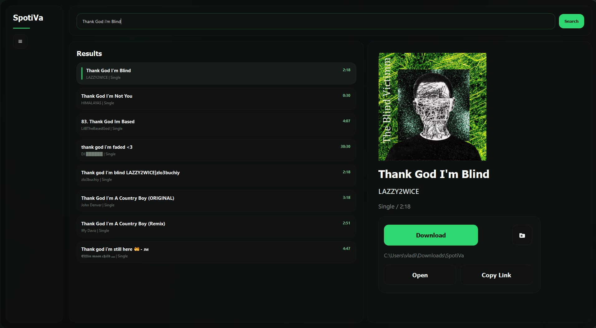
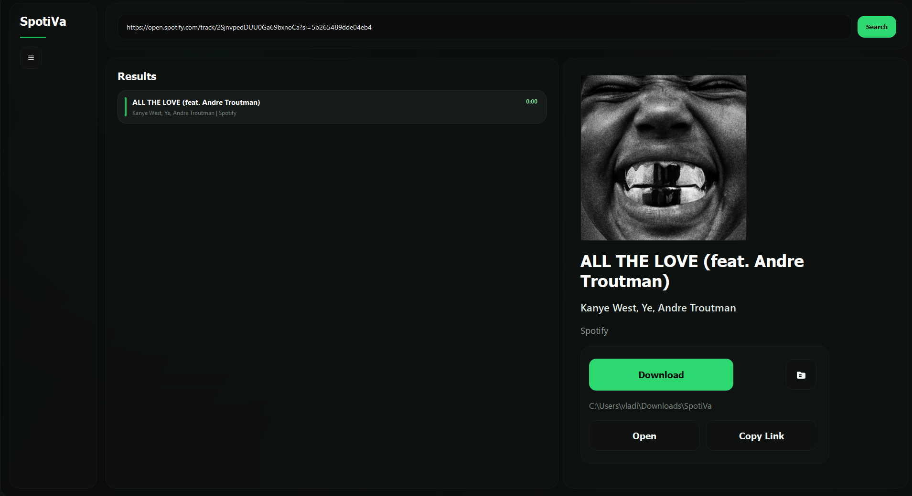
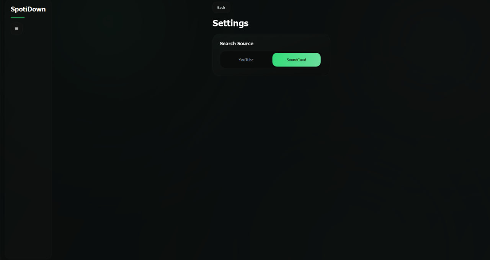

# SpotiVa
SpotiVa is a desktop app for looking up and downloading tracks.

## Features

- Search engine by track title through `YouTube` or `SoundCloud`
- Paste a Spotify track link and download it






## Setup

1. Install FFmpeg and make sure `ffmpeg` is available in your system `PATH`.
2. Install dependencies:

```bash
pip install -r requirements.txt
```

3. Run the app:

```bash
python main.py
```
