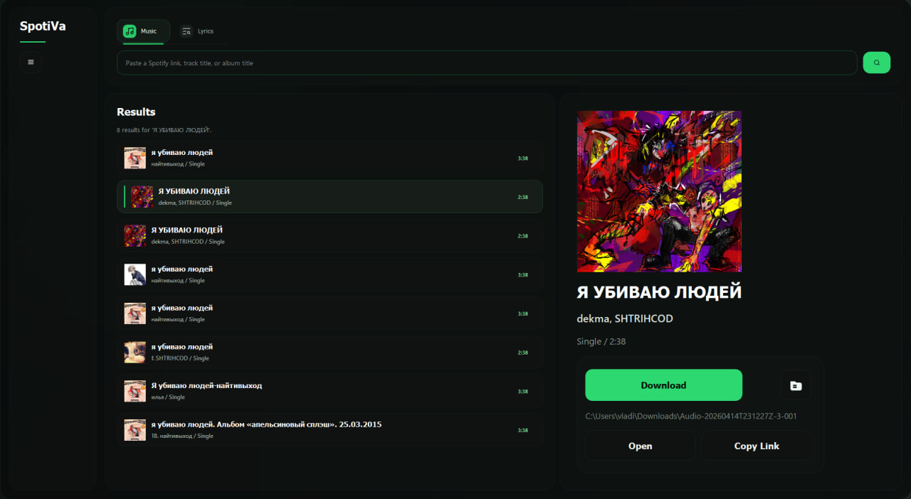
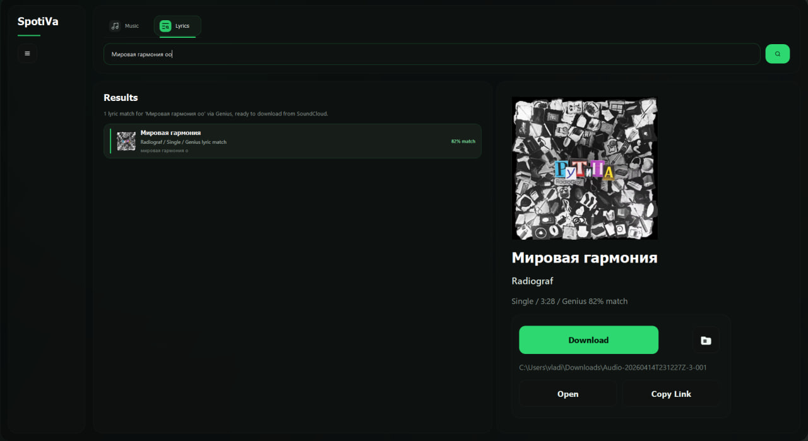
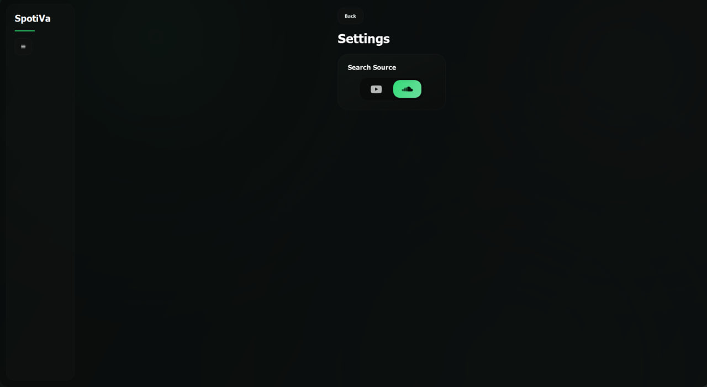

# SpotiVa
SpotiVa is a desktop app for looking up and downloading tracks.


## Features

- Search engine by track title through `YouTube` or `SoundCloud`
- Search by line of lyrics from a song, show likely matches, and download the resolved track (through only SoundCloud)(using Genius parsing and percentage ratio)
- Paste a Spotify track link and download it
- Add in search engine by album title through only SoundCloud
- Paste a Spotify album link and install


***




***

## Setup
### Windows
1. Install FFmpeg and make sure `ffmpeg` is available in your system `PATH`.
2. Create virtual environment in this project (venv):

```bash
python -m venv venv
```

2. Install dependencies:

```bash
pip install -r requirements.txt
```

3. Run the app:

```bash
python main.py
```

