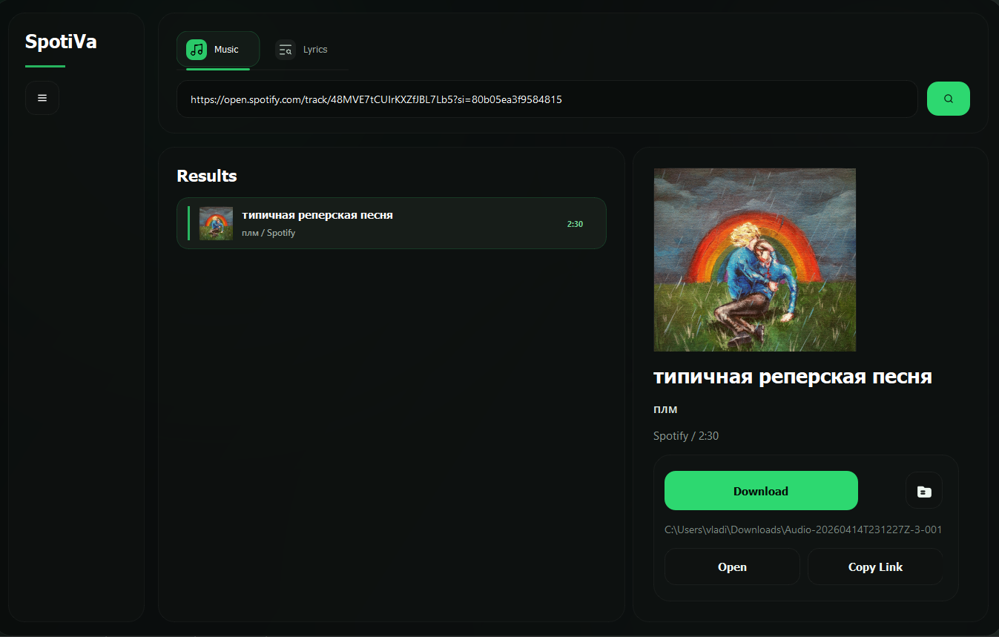
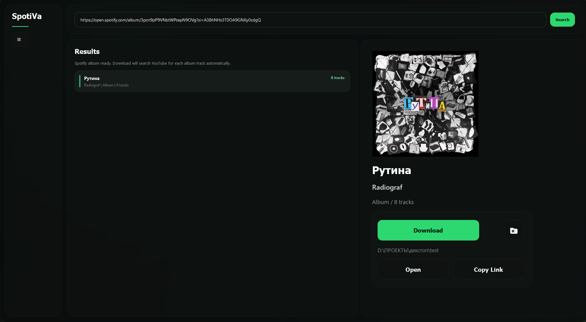

# SpotiVa
SpotiVa is a desktop app for looking up and downloading tracks.

## Features

- Search engine by track title through `YouTube` or `SoundCloud`
- Search by a lyric line with `Genius`, show likely matches, and download the resolved track
- Paste a Spotify track link and download it
- Add in search engine by album title through only SoundCloud
- Paste a Spotify album link and install
- Search by line of lyrics from a song (using Genius parsing and percentage ratio)






## Setup

1. Install FFmpeg and make sure `ffmpeg` is available in your system `PATH`.
2. Install dependencies:

```bash
pip install -r requirements.txt
```

3. Run the app:

```bash
python main.py
```
